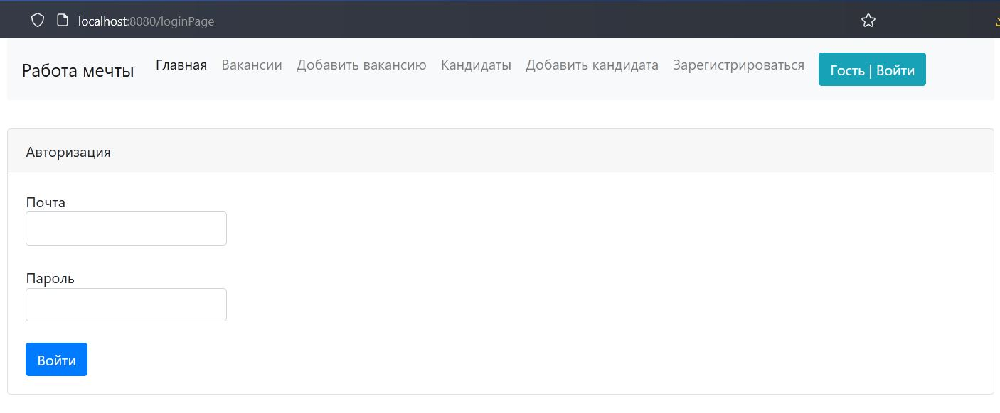
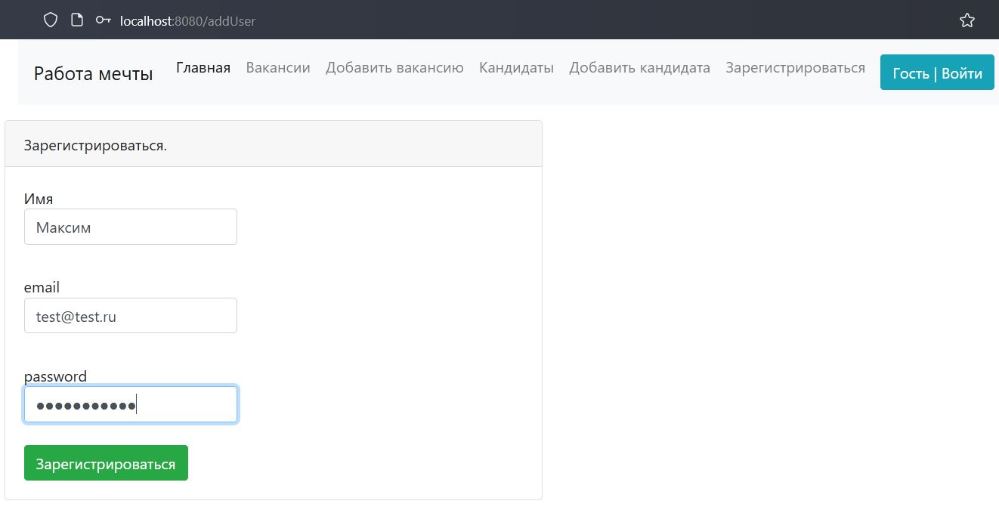
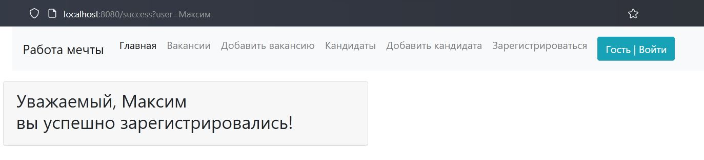
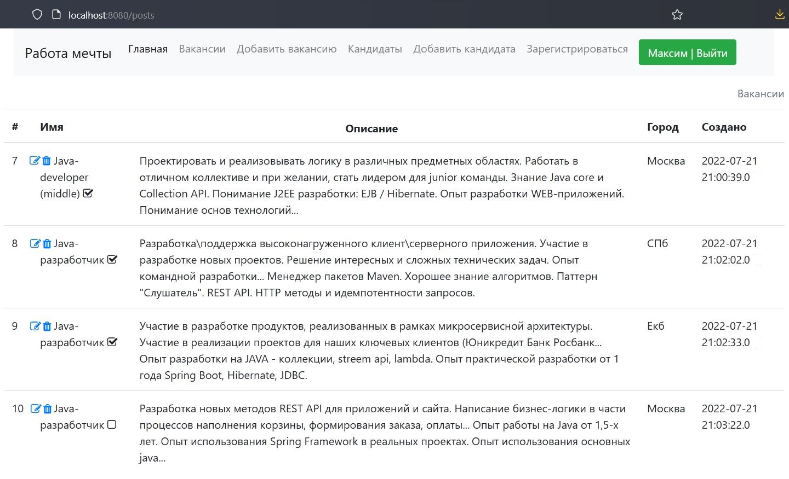
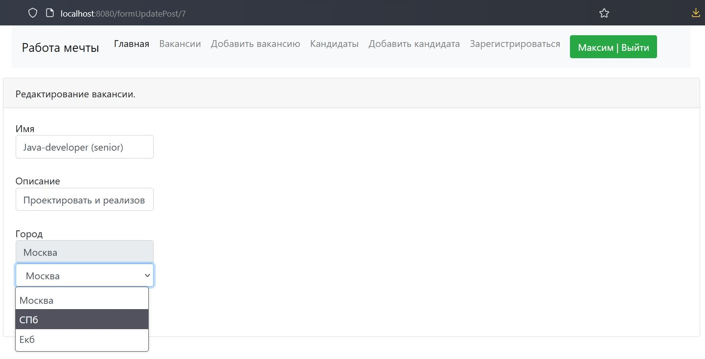
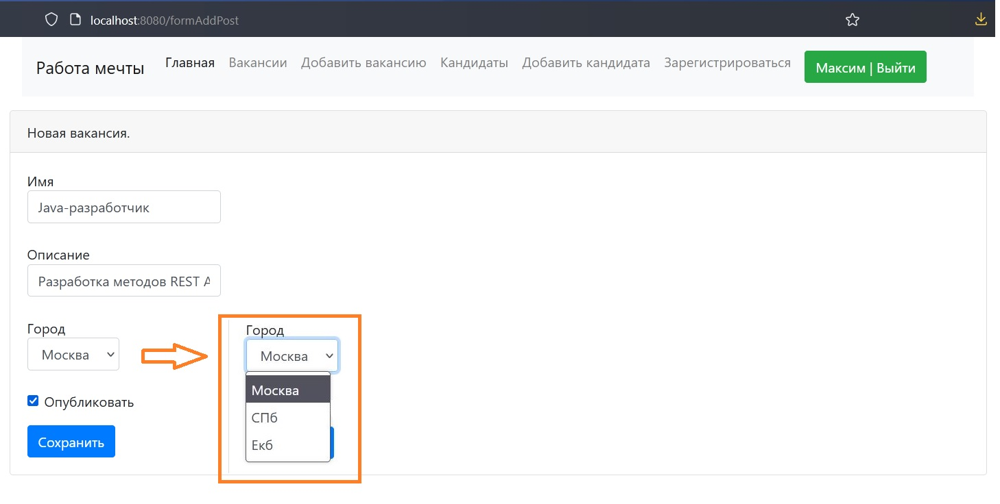
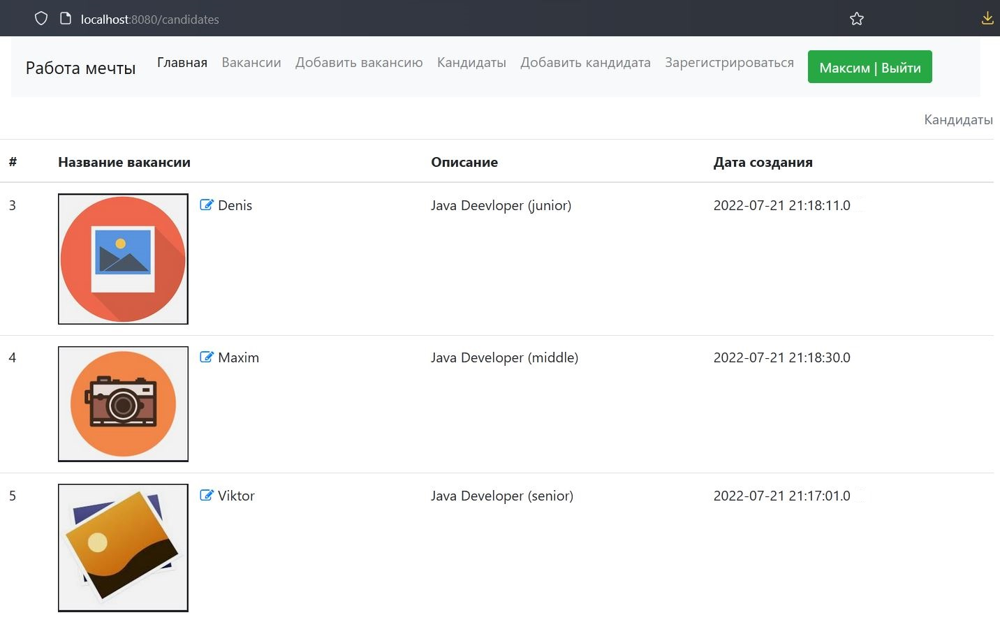
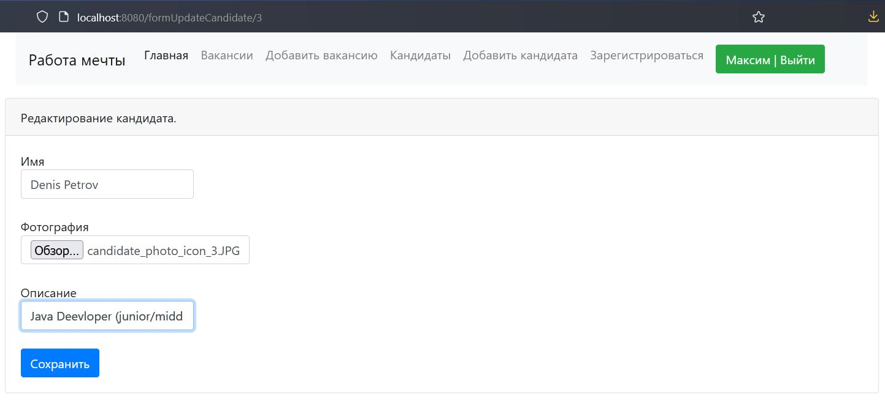
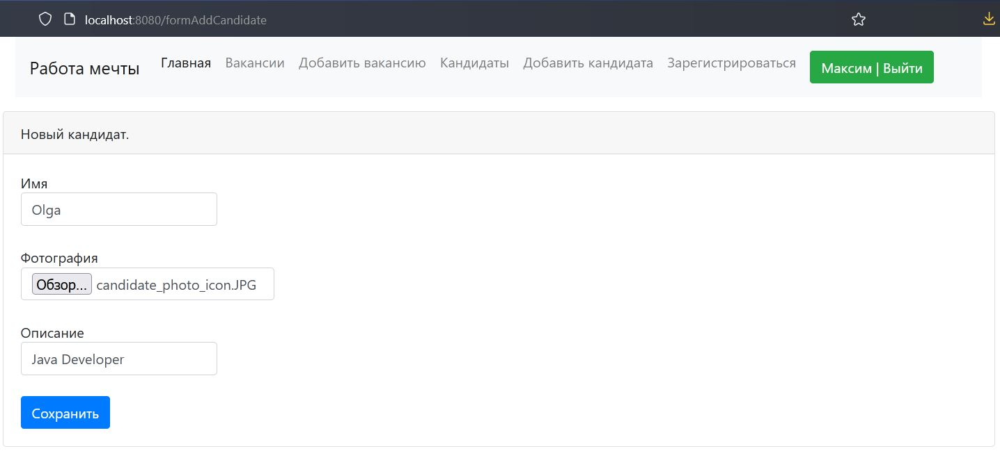

Это учебный проект по разработке  приложения "Работа мечты".

В системе есть две модели: кандидаты и вакансии:
- Кандидаты будут публиковать резюме.
- Специалисты по подбору персонала будут публиковать вакансии о работе.

Кандидаты могут откликнуться на вакансию.

Специалист по подбору персонала может пригласить на вакансию кандидата.
____________________________________________________________________
Прежде чем начать пользоваться сервисом, пользователю необходимо авторизоваться
либо зарегистрироваться в системе, используя навигационное меню страницы /index:

Вид страницы для авторизации ранее зарегистрированного пользователя в системе /loginPage:

Вид страницы для регистрации нового пользователя /addUser:

Вид страницы после успешной регистрации нового пользователя в системе /success:

После авторизации пользователю доступны основные опции приложения, 
размещённые в навигационном меню:

- Вакансии 
(список всех вакансий, как окончательно опубликованных (иконка с галочкой в конце
названия вакансии), так и нет).

Вид страницы /posts:

Вакансии можно редактировать, используя иконку в начале имени.

Вид страницы для редактирования вакансии /formUpdatePost/{id}:
(список городов выбран произвольно и может быть расширен в приложении)

Вид страницы для добавления новой вакансии /formAddPost:

- Кандидаты
(список кандидатов)

Вид страницы /candidates:

Вид страницы для редактирования кандидата /formUpdateCandidate/{id}:

В приложении предусмотрена загрузка фото кандидата (фото кандидатов хранятся
в БД либо могут храниться локально (функционал реализован в пакете services.photoservice))

Вид страницы для добавления нового кандидата /formAddCandidate:

Используемые технологии в проекте:
- Spring boot.
- Thymeleaf.
- Bootstrap.
- JDBC.
- СУБД: PostgreSQL.
- Тестирование: Junit4, Mockito, Liquibase, h2db.